Xin gửi lời chào các bạn đang xem bài viết này. Hôm nay tôi sẽ mang đến
cho các bạn một bài viết tìm hiểu về "Docker" - một trong những công cụ
hỗ trợ phát triển dự án phần mềm. Trong khuôn khổ bài viết ví dụ minh
hoạ đa số sẽ được lấy từ sự hiểu biết của tác giả về chính "Docker" nên
sẽ không thể tránh khỏi thiếu xót. Không dài dòng nửa, chúng ta sẽ bước
vào hành trình tìm hiểu ngay thôi.

1.  **Lịch sử hình thành**

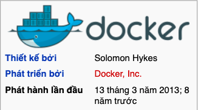{width="3.3958333333333335in"
height="1.8958333333333333in"}

> ***Docker** là một dự án mã nguồn mở giúp tự động triển khai các ứng
> dụng Linux và Windows vào trong các container ảo hóa.*
>
> *Docker cung cấp một lớp trừu tượng và tự động ảo hóa dựa trên Linux.
> Docker sử dụng những tài nguyên cô lập của Linux như cgroups, kernel,
> quản lý tệp để cho phép các container chạy độc lập bên trong một thực
> thể Linux.*

**Với đặc điểm như trên Docker mang lại lợi ích gì và tại sao lại có
tính ứng dụng cao trong quá trình triển khai ứng dụng lên các máy chủ
?**

*Giả sử để chạy một dự án web sử dụng công nghệ PHP - framework là
Laravel chúng ta cần chuẩn bị các yếu tố môi trường như sau:*

1.  *PHP*

2.  *Laravel*

3.  *Database - MySQL, Postgre Sql, ...*

4.  *Máy chủ ảo - Apache, Nginx, ...*

5.  *...*

> *Để cấu hình và cài đặt các yếu tố kể thì không phải phức tạp nhưng
> lại gồm nhiều bước và mỗi hệ điều hành máy tính sẽ hỗ trợ khác nhau
> nên để tối ưu hoá trong quá trình cài đặt môi trường gộp tất cả các
> bước liệt kê ở trên lại thành một chúng ta sẽ sử dụng "Docker".*
>
> **Vậy trước khi có sự ra đời của Docker đó là,**
>
> ***Virtual Machines (Máy ảo) và sự phát triển của Docker***
>
> *Rất lâu trước khi Docker và container xuất hiện, các công ty lớn sẽ
> đi mua nhiều máy chủ để đảm bảo dịch vụ và hoạt động kinh doanh của họ
> không bị ảnh hưởng. Do đó các công ty đã mua nhiều máy chủ hơn mức cần
> thiết và cực kỳ tốn kém. Nhưng họ cần phải làm điều này bởi vì, khi
> ngày càng nhiều người dùng truy cập vào máy chủ của họ, họ muốn mở
> rộng quy mô tốt mà không có thời gian chết hoặc ngừng hoạt động.*
>
> *Sau đó, VMware và IBM ra đời và giới thiệu "[virtualization (ảo
> hóa](https://translate.google.com/translate?hl=vi&prev=_t&sl=en&tl=vi&u=https://dzone.com/articles/the-history-and-state-of-virtualization))"
> cho phép chạy nhiều hệ điều hành trên cùng một máy chủ. Đây là một
> công cụ làm thay đổi lĩnh vực này, nhưng cũng rất tốn kém với nhiều
> kernel và hệ điều hành.*
>
> **Đã có các phương thức khác ra đời sớm hơn và đã đáp ứng được phần
> nào yêu cầu đặt ra ở các hệ thống máy chủ nhưng tại sao Docker đến và
> giành được mảnh đất màu mỡ này ?**
>
> Docker là một hình thức ảo hóa, nhưng không như các máy ảo, các tài
> nguyên trong Docker được chia sẻ trực tiếp với máy chủ. Điều này cho
> phép người dùng chạy nhiều container Docker thay vì chỉ chạy một vài
> máy ảo (VM).

+-----------------------------------+-----------------------------------+
| Docker container                  | Máy ảo                            |
+===================================+===================================+
| -   Chung hệ điều hành với máy    | -   Mỗi VM có thể là 1 hệ điều    |
|     > chủ                         |     > hành riêng biệt.            |
|                                   |                                   |
| -   Sử dụng chung tài nguyên với  | -   Mỗi một máy ảo sẽ chiếm dụng  |
|     > máy chủ như một phần mềm.   |     > một nguồn tài nguyên nhất   |
|                                   |     > định.                       |
+-----------------------------------+-----------------------------------+

> *Một VM phải loại bỏ một lượng tài nguyên đã đặt như dung lượng ổ
> cứng, bộ nhớ, sức mạnh xử lý, giả lập phần cứng và khởi động lại toàn
> bộ hệ điều hành. Sau đó, VM giao tiếp với máy chủ thông qua một ứng
> dụng dịch thuật chạy trên hệ điều hành máy chủ được gọi là
> \"Hypervisor\".*
>
> *Ngược lại, Docker giao tiếp tự nhiên với kernel hệ thống, bỏ qua
> trung gian trên các máy Linux và thậm chí Windows 10, Windows Server
> 2016 trở lên.*
>
> *Điều này có nghĩa là người dùng có thể chạy bất kỳ phiên bản Linux
> nào trong một container và nó sẽ chạy tự nhiên. Không chỉ vậy, Docker
> cũng sử dụng ít dung lượng đĩa hơn.*

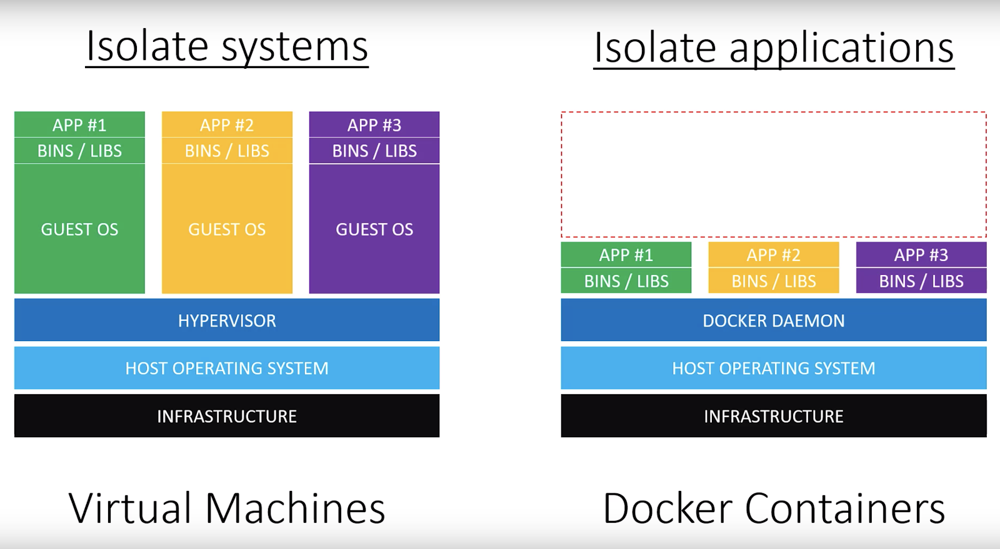{width="6.5in"
height="3.5694444444444446in"}

> *Trong cấu trúc của **Docker Contatiners** có infrastructure và hệ
> điều hành, nhưng không có Hypervisor. Nó có một quy trình chạy trực
> tiếp trên hệ điều hành được gọi là **Docker Daemon**, và nó hỗ trợ
> việc quản lý các tác vụ như chạy container trên hệ thống, images và
> tất cả các lệnh tiện ích đi kèm với Docker.*
>
> *Các ứng dụng chạy trong image này về cơ bản là chạy trực tiếp trên
> máy chủ. Chúng tạo ra các image giống như bản sao của ứng dụng muốn
> phân phối và image đang chạy đó được gọi là một container.*
>
> **Trên đây là sơ lược về bối cảnh lịch sử và nội dung khái quát về
> Docker - tiếp theo sau đây chúng ta sẽ đi cụ thể hơn về Docker.**

**2. Thuật ngữ Docker và các thành phần liên quan**

Ở trên khi so sánh sự khác biệt trong cấu trúc giữa mô hình Docker và VM
thì xuất hiện thêm "**Container**".

> Các phần mềm, chương trình sẽ được **Container Engine** (là một công
> cụ ảo hóa tinh gọn được cài đặt trên host OS) đóng gói thành các
> **container**.
>
> Thế **Container** là gì, nó là một giải pháp để **chuyển giao** phần
> mềm một cách đáng tin cậy giữa các môi trường máy tính khác nhau bằng
> cách:

-   Tạo ra một môi trường chứa **mọi thứ** mà phần mềm cần để có thể
    > chạy được.

-   Không bị các yếu tố liên quan đến môi trường **hệ thống** làm ảnh
    > hưởng tới.

-   Cũng như không làm ảnh hưởng tới các phần còn lại của **hệ thống**.

Hiểu đơn giản các phần như : *mysql, apche, nginx, php* ... sẽ được được
bỏ gọn vào một hoặc nhiều cái thùng (container), ứng dụng của bạn chạy
trong những chiếc thùng đó, đã có sẵn mọi thứ cần thiết để hoạt động,
không bị ảnh hưởng từ bên ngoài và cũng không gây ảnh hưởng ra ngoài.

*Ví dụ, bạn có một app PHP, bạn sẽ không cần cài đặt PHP vào máy thật để
chạy app đó, chỉ cần kiếm container đã được setting tương ứng cho app
về, bật nó lên, cho app chạy bên trong môi trường container đó, vậy là
ok. Khi không sài nữa thì tắt hoặc xóa bỏ container đó đi, không ảnh
hưởng gì tới máy thật của bạn.\
***\
Image:** image về cơ bản là một gói thực thi có mọi thứ cần thiết để
chạy các ứng dụng, bao gồm tệp cấu hình, biến environment, thời gian
chạy và thư viện.

-   **Dockerfile:** chứa tất cả các hướng dẫn để xây dựng Docker image.
    > Văn bản này được coi là tự động hóa việc tạo Docker image.

**Build:** Tạo image snapshot từ Dockerfile.

-   **Tag:** Phiên bản của một image. Mỗi image sẽ có một tag riêng.

**Container:** Gói/đơn vị phần mềm nhẹ được tạo từ một phiên bản image
cụ thể.

-   **DockerHub:** Kho lưu trữ image nơi người dùng có thể tìm thấy các
    > loại image khác nhau.

**Docker Daemon:** Docker Daemon chạy trên hệ thống máy chủ. Người dùng
không thể giao tiếp trực tiếp với Docker Daemon, chỉ với các máy khách
Docker.

**Docker Engine:** Hệ thống cho phép tạo và chạy các container Docker.

-   **Docker Client:** Đây là giao diện người dùng chính cho Docker ở
    > định dạng nhị phân Docker. Docker Daemon sẽ nhận được các lệnh
    > Docker từ người dùng và xác thực thông qua giao tiếp với Docker
    > daemon.

**Docker registry:** Docker registry là một giải pháp lưu trữ Docker
image. Dịch vụ này chịu trách nhiệm lưu trữ và phân phối image. Registry
mặc định là Docker Hub.

***Trên đây là một vài thuật ngữ liên quan về Docker và tiếp theo sẽ là
phần cài đặt. Chúng ta sẽ cài đặt Docker như thế nào ? Điều này có đơn
giản và tối ưu ở mỗi hệ điều hành khác nhau hay không ?***

**3. Cài đặt Docker**

-   *Docker hỗ trợ nhiều nền tảng hệ điều hành khác nhau bao gồm Linux,
    > Windows và cả Mac. Ngoài ra, Docker còn hỗ trợ nhiều dịch vụ điện
    > toán đám mây nổi tiếng như Microsoft Azure hay Amazon Web
    > Services.*

-   *Ban đầu nó được xây dựng trên nền tảng Linux. Vì Docker cần can
    > thiệp vào phần lõi, nhân Kernel trong khi đó Linux là mã nguồn mở
    > nên sẽ dễ dàng sử dụng - "thích thì chiều - cần là có".*

-   *Cho tới hiện tại khi cài Docker trên Windows hay Mac thì Docker sẽ
    > cài một máy ảo Linux trên máy thật và Docker hoạt động dựa trên
    > máy ảo Linux đó. (thông tin này có thể đã cũ nhưng tới thời điểm
    > thực hiện bài viết tôi vẫn chưa tìm thấy thông tin nào mới hơn nên
    > có gì sai sót mọi người hãy góp ý ở bên dưới phần bình luận nhé)*

**[Trên MacOS:]{.underline}**

Tất cả những gì bạn cần làm đó là truy cập [[trang tải
xuống]{.underline}](https://www.docker.com/products/docker-desktop)
chính thức và lựa chọn tuỳ theo dòng máy bạn đang sở hữu là chip
***Intel*** hoặc ***M1***.

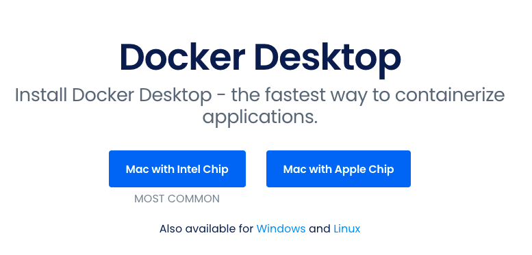{width="6.5in"
height="3.125in"}

Bạn sẽ nhận được một tệp Apple Disk Image, bạn chỉ cần nhấp chuột khởi
động tệp này và sau đó thực thi như hướng dẫn của trình cài đặt.

Sau khi hoàn tất cài đặt giống như hình dưới là Docker đã sẵn sàng phục
vụ chúng ta rồi.

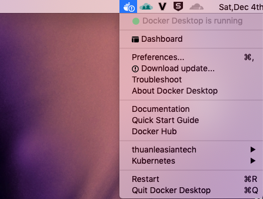{width="4.65625in"
height="3.5208333333333335in"}

**[Trên Windows:]{.underline}**

Tương tự trên MacOS trên các dòng máy Windows cũng có trình hỗ trợ cài
đặt. Mọi người có thể tham khảo các bước như phần cài đặt trên MacOs.

**[Trên các distro khác của Linux:]{.underline}**

Trong phần tải xuống Docker dành cho
[[Linux]{.underline}](https://hub.docker.com/search?offering=community&operating_system=linux&q=&type=edition)
sẽ chuyển bạn đến một trang gồm những distro linux được hỗ trợ bạn chỉ
cần chọn distro phù hợp và thực hiện theo hướng dẫn sau đó.

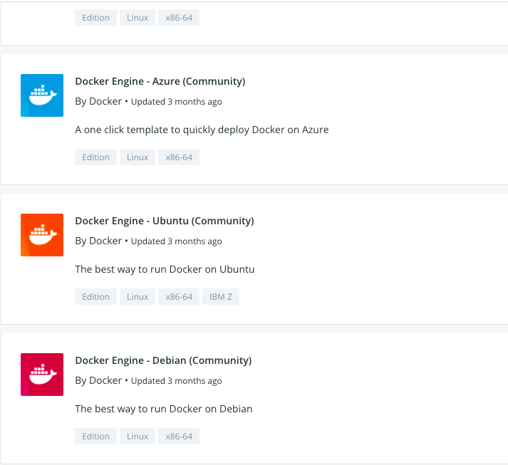{width="6.5in"
height="5.958333333333333in"}

**Sau khi cài đặt xong xuôi thì chúng ta cùng tìm hiểu về các câu lệnh
cơ bản của Docker trong phần tiếp theo.**

**4. Các câu lệnh sử dụng trong Docker**

Chuẩn chỉnh & đầy đủ nhất thì bạn cứ tham khảo trên [trang
chủ](https://www.docker.com/) của [docker
docs.](https://docs.docker.com/) Còn ở bài viết này sẽ trích dẫn những
câu lệnh cơ bản nhất giúp các bạn nhanh chóng nắm bắt:

1.  Pull một image từ Docker Hub

> *sudo docker pull image_name*

2.  Tạo mới container bằng cách chạy image, kèm theo các tùy chọn:

> *sudo docker run -v \<forder_in_computer>:\<forder_in_container> -p
> \<port_in_computer>:\<port_in_container> -it \<image_name> /bin/bash*
>
> *Ví dụ:*
>
> *sudo docker pull ubuntu:16.04*
>
> *sudo docker run -it ubuntu:16.04 /bin/bash*
>
> Bây giờ chúng ta đã dựng thành công một môi trường ubuntu ảo rồi đó.
>
> Sử dụng câu lệnh:
>
> *uname -a*
>
> Để kiểm tra sự khác biệt giữa các môi trường.
>
> 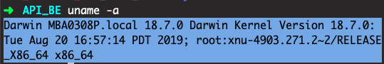{width="5.614583333333333in"
> height="0.9375in"}
>
> Bên trên là máy thật.
>
> 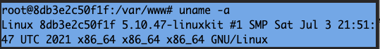{width="5.614583333333333in"
> height="0.7291666666666666in"}
>
> Còn đây là thông tin của **container Linux** - (mình tận dụng từ dự án
> đang làm việc nên không thể chụp ảnh toàn màn hình để mọi người dễ so
> sánh).

3.  Một số câu lệnh khác:

> *docker images: Liệt kê các images hiện có*
>
> *docker rmi {image_id/name}: Xóa một image*
>
> *docker ps: Liệt kê các container đang chạy*
>
> *docker ps -a: Liệt kê các container đã tắt*
>
> *docker rm -f {container_id/name}: Xóa một container*
>
> *docker start {new_container_name}: Khởi động một container*
>
> *docker exec -it {new_container_name} /bin/bash: Truy cập vào
> container đang chạy*

*Tiếp ngay sau đây là sử dụng **docker** vào dự án một cách dễ dàng và
đơn giản nhất đó là sử dụng **dockerfile.** Vậy **dockerfile** nó sẽ
hoạt động như nào, chúng ta cùng đến với phần sau ngay nào.*

**5. Tìm hiểu Dockerfile**

-   Đơn giản nó là một file text nhưng không có đuôi giống mấy ông
    > \*.doc hay \*.exe đâu nhá.

-   Nó là như một cái khung được đính kèm lên đó các câu lệnh - mỗi dòng
    > lệnh trong đó sẽ định hình cho **docker image**. Từ khung "xương
    > sống" này **Docker** sẽ đóng gói thành một **Docker image** theo
    > tuỳ biến riêng của bạn.

-   Đơn giản hơn mọi người nhìn hình minh hoạ cho dễ hiểu nhé.

> 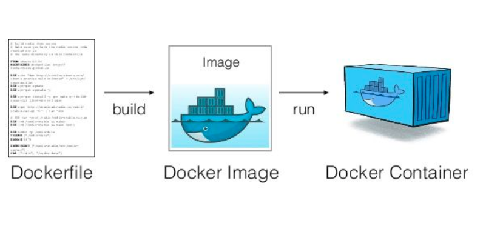{width="6.5in"
> height="3.125in"}
>
> **[Rút ra một điều là]{.underline}**:
>
> *Dockerfile sẽ quy định Docker image được khởi tạo từ đâu, gồm những
> gì trong đó.*
>
> **Lý thuyết vậy đủ rồi, giờ làm sao để tạo ra một Dockerfile ?**
>
> **[Cách viết Dockerfile:]{.underline}**

-   Đầu tiên chúng ta sẽ viết Dockerfile để tạo nên image rồi tạo nên
    > container, sau khi tạo được container rồi thì đồng nghĩa là đã tạo
    > ra được máy ảo để bạn có thể khởi chạy ứng dụng của bạn trên máy
    > ảo đó.

-   Thư mục webroot chứa mã nguồn chương trình, có thể là một c++ app,
    > java app hoặc web app được viết bằng php hoặc ruby,\.... (Ở đây,
    > để cho đơn giản, chúng ta chỉ đặt file hello.html, chạy trên trình
    > duyệt sẽ hiển thị dòng Hello Word)\
    > Sau này, bạn dùng editor để lập trình trên máy thật, chỉnh sửa mã
    > nguồn trong thư mục này, mọi sự thay đổi được cập nhật ngay lập
    > tức trên máy ảo.

-   File start.sh chứa những câu lệnh được chạy khi bật container (có
    > thể dùng để start mysql, nginx, redis \...)

> File Dockefile sẽ gồm các thành phần chính như sau:

1.  Thiết lập image gốc

> Sử dụng cú pháp:
>
> FROM:
>
> Image gốc có thể là centos:7, ubuntu:16.04, ...
>
> Image gốc cho biết được rằng sẽ có lõi khởi động là thằng nào như
> những ví dụ ở trên.
>
> Ví dụ:
>
> FROM ubuntu:16.04
>
> *Để tìm hiểu vọc vạch nhiều hơn thì chúng ta có thể ghé lại - [Docker
> hub](https://hub.docker.com/) - nơi lưu trữ và chia sẻ các image sẽ
> chứa những image gốc mà từ đó, bạn có thể phát triển, cài cắm, thay
> tháo, chỉnh sửa, thêm bớt để tạo ra những images tùy biến cho riêng
> bạn.*
>
> 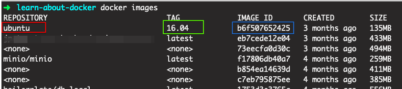{width="6.5in"
> height="1.4444444444444444in"}
>
> Khi Docker đọc tới câu lệnh này, nó sẽ tự động tìm xem image
> ubuntu:16.04 này đã tồn tại trong máy chưa, nếu chưa thì Docker sẽ tự
> động pull image này về. Trong đó ubuntu là tên của image, 16:04 là
> tag - version của image đó.
>
> Sử dụng cú pháp:
>
> MAINTAINER
>
> Một optional dùng để đặt tên cho tác giả của Dockerfile mà bạn đang
> viết.
>
> Ví dụ:
>
> MAINTAINER ThuanLe\<thuan.le\@monstar-lab.com>

2.  Cài đặt các ứng dụng

> Sau khi đã có "gốc" chúng ta sẽ đi dựng cái "thân" tức là các ứng dụng
> sẽ chạy trong **container** này.
>
> Bạn có thể cài nginx, php, python, ruby, java \... phụ thuộc vào nhu
> cầu của bạn, sử dụng:

-   **RUN** : Để thực thi một câu lệnh nào đó trong quá trình build
    > images.

-   **CMD** : Để thực thi một câu lệnh trong quá trình bật container.\
    > Mỗi Dockerfile chỉ có một câu lệnh CMD, nếu như có nhiều hơn một
    > câu lệnh CMD thì chỉ có câu lệnh CMD cuối cùng được sử dụng.\
    > Một câu hỏi đặt ra là nếu tôi muốn khởi động nhiều ứng dụng khi
    > start container thì sao, lúc đó hay nghĩ tới ENTRYPOINT

-   **ENTRYPOINT**: Để thực thi một số câu lệnh trong quá trình start
    > container, những câu lệnh này sẽ được viết trong file .sh.

> Ví dụ:
>
> 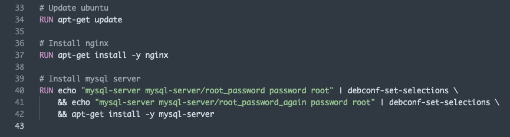{width="6.5in"
> height="1.75in"}
>
> Trong khi cài nginx, sẽ có câu hỏi xuất hiện và bạn cần trả lời
> yes/no, khi đó tùy chọn -y trong RUN apt-get install -y nginx sẽ thể
> hiện cho sự lựa chọn yes của bạn.

3.  Cấu hình

-   **EXPOSE**: Container sẽ lắng nghe trên các cổng mạng được chỉ định
    > khi chạy.

-   **ADD** : Copy file, thư mục, remote file thêm chúng vào filesystem
    > của image.

-   **COPY** : Copy file, thư mục từ host machine vào image. Có thể sử
    > dụng url cho tập tin cần copy.

-   **WORKDIR** : Định nghĩa directory cho CMD.

-   **VOLUME** : Mount thư mục từ máy host vào container.

-   Tạo file start.sh .

> Ví dụ:
>
> 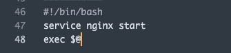{width="3.4895833333333335in"
> height="0.8020833333333334in"}

Tổng kết lại ta có một ví dụ cho phần cấu hình như sau:

> 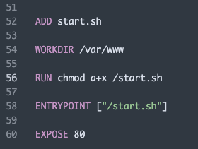{width="2.9166666666666665in"
> height="2.1979166666666665in"}
>
> Sau cùng là toàn bộ một file Dockerfile đơn giản tổng hợp từ trên
> xuống dưới như sau:
>
> 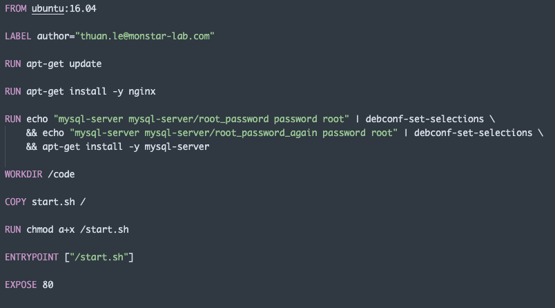{width="6.5in"
> height="3.611111111111111in"}
>
> Tiếp theo chúng ta cùng tạo tiếp một file helloworld.html để lát nửa
> demo xem gọi nó có chạy vào được không chứ còn gì nửa.
>
> \<h1>Hello word\</h1>
>
> Code mẫu sẽ được update ở cuối bài viết nha mọi người cứ vững tâm tiếp
> tục theo dõi.
>
> Mọi điều kiện đã xong, giờ bắt nó - Dockerfile phải hoạt động thôi.

**6. Sử dụng Dockerfile**

**Build docker image từ Dockerfile**

Ta sẽ sử dụng dạng câu lệnh như sau:

*sudo docker build -t \<image_name> .*

> Ví dụ như sau:
>
> ​​sudo docker build -t ubuntu-nginx .
>
> Lưu ý, nếu sử dụng MacOs thì chỉ cần bỏ chữ sudo đi nếu bạn không
> thích nhập mật khẩu của thiết bị đang sử dụng nhé. Câu lệnh này phù
> hợp cho nền tảng Linux nhiều hơn.
>
> Sau đó bạn hãy dùng lệnh docker images để kiểm tra xem có tạo ra được
> docker image giống mình không nhé.
>
> 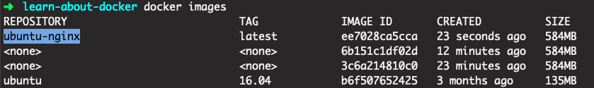{width="6.5in"
> height="0.9722222222222222in"}
>
> **Tạo container từ image**
>
> Ta sử dụng dạng cú pháp sau:
>
> *sudo docker run -v \<forder_in_computer>:\<forder_in_container> -p
> \<port_in_computer>:\<port_in_container> -it \<image_name> /bin/bash*
>
> Trong đó:
>
> ***-v** : Thể hiện việc mount volume, dữ liệu từ thư mục từ máy thật
> có thể được truy cập từ thư mục của máy ảo.*
>
> ***-p**: Cổng mạng từ máy thật để dẫn tới cổng mạng của máy ảo đang
> chạy.*
>
> ***-t**: Chạy container và mở terminal bằng /bin/bash*
>
> *Ví dụ vào localhost mặc định của nginx:*
>
> *docker run -p 9000:80 -it ubuntu-nginx /bin/bash*
>
> Trên terminal sẽ giống như này:
>
> 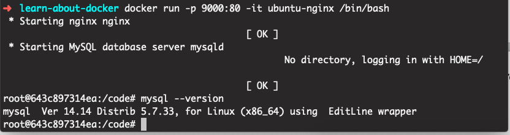{width="6.5in"
> height="1.7222222222222223in"}
>
> Trên trình duyệt sẽ giống như này:
>
> 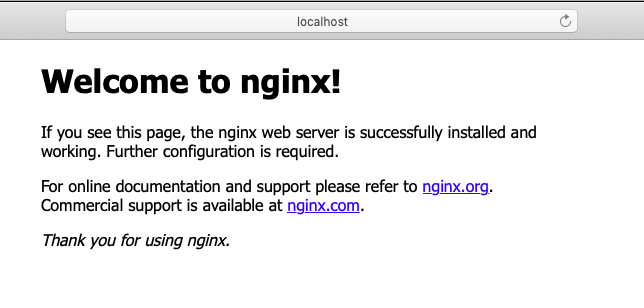{width="6.5in"
> height="3.111111111111111in"}
>
> Ps: localhost:9000 - là đường dẫn nhé mọi người, và vì sao nó là cổng
> 9000 thì đó là do câu lệnh tạo ở trên chúng ta gán cổng (**-p**) là
> 9000 nhé.
>
> Rồi giờ tới công chiện với cái file **helloworld.html** chúng ta đã
> tạo ra ở trên. Giờ làm sao test nó đây?
>
> Giả sử thư mục dự án trên máy thật là của mình đang là như thế này:
>
> */Users/mba0308p/AST_PHP/Blog/learn-about-docker/code*
>
> Câu lệnh tạo **container** sẽ như sau:
>
> *docker run -v
> /Users/mba0308p/AST_PHP/Blog/learn-about-docker/code:/var/www/html -p
> 9000:80 -it ubuntu-nginx /bin/bash*
>
> Trên máy của mọi người tuỳ vào đường dẫn của thư mục máy thật mà thay
> thế cho hợp lý nhé.
>
> Và tèn ten kết quả sẽ thu được như sau:
>
> *localhost:9000/helloworld.html*
>
> 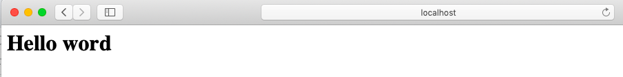{width="6.5in"
> height="0.8194444444444444in"}
>
> Source code phần này mình đặt tại
> [[đây]{.underline}](https://github.com/mvn-thuanle-dn/learn-about-docker/tree/learn-about-docker-1)
> nhé mọi người cùng tham khảo thêm.

**7. Tạm kết**

Cảm ơn mọi người vì đã đồng hành cùng mình đến với phần cuối cùng của
chương mở đầu cho series về tìm hiểu **Docker.** Phía trước vẫn còn một
chặng đường cực kỳ nhiều thứ hay ho (nhưng không dương tính nhé) chờ đợi
chúng ta cùng nhau khám phá. Ở phần tiếp theo, chúng ta sẽ cùng nhau tìm
hiểu về làm sao để kết hợp nhiều container riêng lẻ đang hoạt động lại
với nhau - vì đơn giản chúng ta đang đứng trên vai những người khổng lồ.
Không việc gì chúng ta phải đi tạo ra những thứ đã có sẵn. Bùm và phần
tiếp theo sẽ là Docker-compose.

Đây là bài viết đầu tay của tác giả nên không thể tránh khỏi việc sơ
xuất và thiếu sót trong khâu biên soạn tổ chức ngôn từ hay như sắp xếp
các yếu tố tổng thể. Mọi sơ xuất và thiếu sót mong được nhiều hảo huynh
đệ bằng hữu gần xa nhiệt tình đóng góp.

{width="6.25in"
height="3.75in"}
